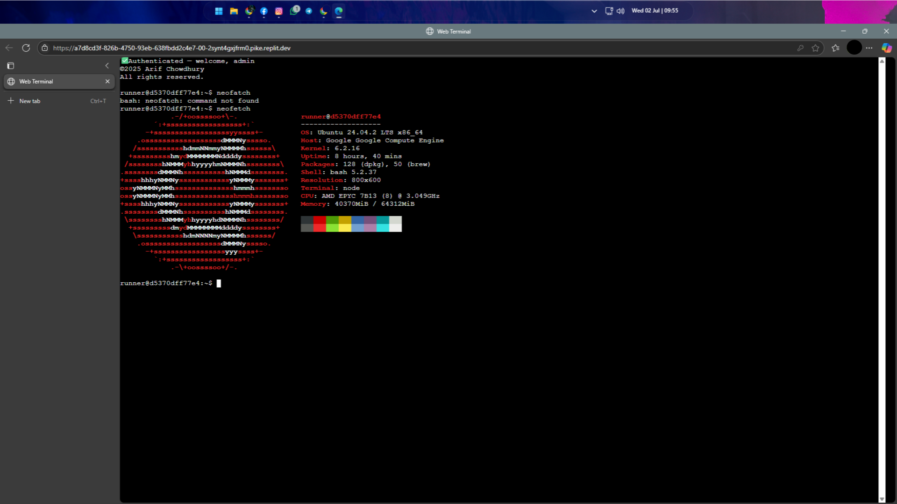

# 🌐 SSHADOW

> A real-time, browser-based Linux terminal powered by Node.js, WebSockets, xterm.js, and a secure Python CLI client.

### 🔒 Built for remote access, development, learning, demos, and debugging.

---

## ✨ Features

- 🖥️ **Fully interactive Linux terminal** (bash) over WebSocket
- 🔐 **Login authentication** (username & password)
- 🌍 **Web-based UI** using `xterm.js`
- 📡 **Real-time terminal streaming** (input/output)
- 🧠 **Auto-resize support** for terminal size syncing
- 🧑‍💻 **Python CLI client** for native terminal connection
- ⚡ Minimal, portable, and easy to deploy

---

## 📁 Project Structure

```

├── app.js          # Node.js WebSocket + PTY backend
├── index.html      # Web-based terminal UI (login + xterm)
├── client.py       # Python CLI WebSocket client
└── package.json    # Node project config

````

---

## 🚀 Getting Started

### 1. 🧱 Prerequisites

- **Node.js** (v14+)
- **Python 3** (Linux/Mac, for client)
- Bash shell available (`/bin/bash`)
- Linux/macOS terminal recommended

---

### 2. 🔌 Start the WebSocket Server

```bash
npm install express ws node-pty
node app.js
````

The server will start on [http://localhost:8080](http://localhost:8080)

> The default credentials are:
> **Username:** `admin`
> **Password:** `admin`

---

### 3. 🌐 Use the Web Terminal (Frontend)

Visit: [http://localhost:8080](http://localhost:8080)

* Login with your credentials
* You'll see a full interactive shell right in your browser!

---

### 4. 🐍 Use the Python CLI Client

```bash
python3 client.py -H localhost:8080 -u admin -p admin
```

Or run interactively:

```bash
python3 client.py
```

You'll be prompted for host, username, and password.

✅ Arrow keys, terminal resize, and commands are fully supported.

---

## 🛡️ Security

This project is intended for **educational, internal, and secure use only**. If deploying publicly, you should:

* Use **TLS** (`wss://`) with a reverse proxy like Nginx
* Replace hardcoded credentials with a database or user manager
* Rate-limit connections
* Add IP filtering / authentication layers

---

## 📷 Screenshot



---

## ⚙️ Configuration

You can modify default credentials in `app.js`:

```js
const uname = "admin";
const pwd = "admin";
```

To use a different shell (e.g., `zsh`, `fish`, `cmd.exe`), update this line:

```js
pty.spawn('/bin/bash', ['-l'], { ... })
```

---

## 📦 Deployment

This project runs anywhere Node.js is supported:

* Replit
* Vercel (with WebSocket proxying)
* Render
* VPS (Ubuntu/Debian/Alpine)
* Localhost or Docker

---

## 🤝 Contributing

Pull requests are welcome! Feel free to fork, modify, and share.

If you add enhancements (multi-user auth, logging, etc.), consider submitting a PR!

---

## 📄 License

© 2025 Arif Chowdhury
All rights reserved.
This project is open-source for educational and personal use. Please respect license boundaries when modifying or redistributing.

---

## 🧠 Credits

* [xterm.js](https://xtermjs.org/)
* [node-pty](https://github.com/microsoft/node-pty)
* [WebSocket](https://github.com/websockets/ws)
* [Express](https://expressjs.com/)

